\centerline{Gabriel Fruet}

# Capitulo 2.

## Processos

### O modelo de processo.

- Processo 

> Instância de Software executando.

- Multiprogramção 

> A troca rápida de processos executando pela CPU

- Processos não deve ser programados com assunção de tempo

- Processo X Programa

> O programa é a receita do bolo

> A pessoa que cozinha é a CPU

> Os ingredientes são a entrada

> E tudo isso constitui o processo.

### Criação de processos.

- `Daemons` são processos que rodam no background do sistema e são responsáveis por tarefas esporádicas.
- Única chamada de sistema para criar processos: `fork`
- fork cria uma copia exata do processo pai, só diferindo o retorno da chamada fork.
- COW(copy-on-write) é por vezes usado.

### Término de processos.

1. Normal exit(voluntário)
2. Error exit(voluntário)
3. Fatal error(involuntário)
4. Killed by another process(involuntário)

### Hierárquia de processos.

- Um processo só tem um pai, mas pode ter vários filhos
- Um processo e seus descente são considerados um `process group`
- Todos os processos pertencem a uma única árvore com `init` como raiz,
o `init` cria os terminais para que os usuários entrem.

### Estados dos processos

`cat file1 file2 file3 | grep tree`

Talvez, quando `grep` já estivesse pronto para receber entrada,
`cat` ainda esteja lendo os arquivos. Ou seja, `grep` estava **bloqueado**
esperando que `cat` o fornecesse uma entrada.

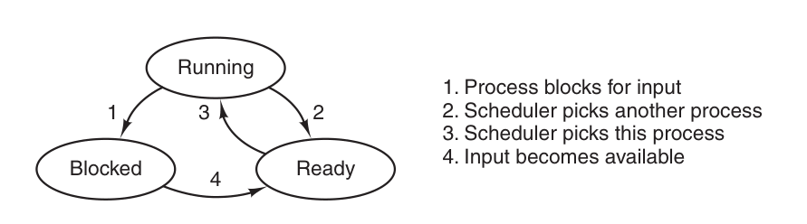

1. Feito quando o S.O percebe que a execução desse processo 
não pode mais continuar por enquanto.
2. *Quantum* de tempo de CPU para o processo acabou, o S.O cede 
para outro processo a CPU.
3. Ocorre quando todos os outros processos já tiveram sua fatia
justa de *quantum* de tempo de CPU e agora é a vez do processo observado rodar.
4. Ocorre quando um processo que foi interrompido por não ser possível continuar(e.g
esperando entrada do teclado) recebe o recurso necessário para continuar. 

### Implementação de processos.

- O sistema operacional mantém uma **tabela de processos** chamada `process table` com uma
entrada por processo.
- Associado com cada entrada e saída, existe o **vetor de interrupções**. Suponha que 
o processo 3 é interrompido por uma interrupção de disco,
todo seu contexto é devidamente salvo pelo hardware(empilha) e o hardware muda o PC
para a posição correspondente no vetor de interrupção. Após isso, o código chama uma 
subrotina escrita em C(geralmente) para lidar com interrupção

### Modelando multiprogramação

- CPU Utilization = $1 - p^n$
- $p$ é a % de IO e $n$ o número de processos.

## Threads

### Uso de threads.

1. Aplicações podem ter várias atividades diferentes sendo executadas, umas bloqueadas
e outras não. Ao decompor seu programa em threads, as atividades bloqueadas podem ceder
sua execução para atividades prontas.
2. A possibilidade de subprocessos compartilhariam o mesmo espaço de endereçamento.
3. Algumas aplicações precisam que suas atividades compartilhem o mesmo espaço de endereçamento, 
por isso usar threads.
4. São mais **leve** que procesos, mais **faceis** de criar e mais **rápidas**.
5. Threads possibilitam que as atividades bloqueantes e não bloqueantes sejam intercambiadas.

### O modelo clássico de threads.

- O modelo de processos é baseado em duas coisas: agrupamento de recursos e execução, porém,
as vezes é interessante separar esses conceitos.

- Todo processo possui uma linha de execução, chamada de thread, que é o seu PC, registradores, uma pilha
de funções que ainda não foram retornadas.

- Apesar de que uma thread precisa ser executada em um processo, são conceitos diferentes.

- Processos 

> Agrupamento de recursos.

- Thread 

> Entidade de escalonamento para execução na CPU.

- O que as thread adicionam ao modelo de processo?

> Multiplas execuções em um mesmo ambiente de processo

- Por vezes, as threads são chamadas de *lightweigth processes*

- Diferentes threads em um processo não são tão independentes quanto diferentes processos.

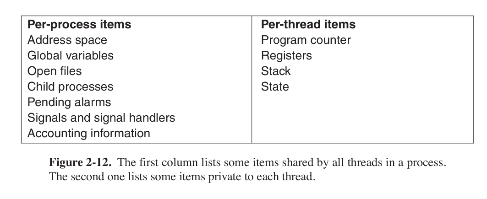

- Da mesma maneira que um **processo**, uma thread têm estados iguais aos dos processos,
*blocked*, *running*, *ready*.

- Cada thread tem sua própria pilha de execução.

### Threads no espaço do usuário.

- O kernel não sabe nada sobre as threads. 

- Pode ser implementado em um sistema operacional que **não suporta threads**.

- Cada processo precisa ter sua ***thread table***, que é análogo a **tabela de processos**, 
mas é gerenciada pelo *runtime* do programa.

- Cada processo pode ter seu próprio algoritmo de escalonamento.

- Uma das maiores disvantagens é que as `syscalls` bloqueiam a execução do programa(todas as thread),
sendo que, o principal motivo de termos threads, é aproveitar o tempo bloqueada de alguma thread.

- Uma forma de solucionar isso é usar a chamada `select`.

- Outro problema é que, enquanto uma thread roda, as outras só poderão ser executadas se a thread
principalmente voluntariamente ceder seu tempo de CPU.

### Threads no espaço do kernel.

- Kernel possuiria uma tabela de *threads*, com a mesma informação das *threads* de espaço do usuário.

- Quando chamadas de sistema bloqueiam, o kernel pode escolher uma *thread* do mesmo processo ou de
um processo diferente.

- Todas as chamadas bloqueantes, são implementadas como chamadas de sistema, para que, o kernel possa 
decidir qual thread escalonar.

- Um dos problemas é o `fork`, o que é copiado em um fork?

### Implementações híbridas.

- Uma das formas é criar threads no espaço do kernel e multiplexar threads no espaço do usuário nelas. 


- Nesse caso, o kernel só escalona as threads no espaço do kernel.

### Tornando código *single-threaded* em código *multi-threaded*

- Variáveis globais acessadas por múltiplas threads são problemáticas.

- `read_global` & `write_global`

## Comunicação entre processos.

### Condições de corrida.

- Processo pode ser interrompido enquanto está executando um código crítico,
que pode deixar algo inconsistente. 

- Extremamente díficil de debugar.

### Região crítica.

- Identificar regiões críticas é uma maneira interessante diagnosticar condições de corrida.

- **Exclusão mútua** (i.e ***Mutex***)

> Se um processo está executando e está acessando alguma variável ou arquivo compartilhado,
precisamos fazer com que processos que acessam essas mesmas variáveis e arquivos compartilhados
sejam excluídos de serem escalonados.

- Trechos de código que compartilham variáveis ou arquivos com outros processos ou subprocessos
devem ser considerados região crítica

- Condições necessárias para evitar condições de corrida

    1. Dois processos não devem estar simultaneamente na sua regiao crítica
    2. Nenhuma assunção deve ser feita sobre tempo, velocidade ou número de CPU's
    3. Nenhum processo fora de sua região crítica deve bloquear outro processo
    4. Nenhum processo deve esperar eternamente para entrar na sua região crítica

### Exclusão mútua com *busy waiting*

#### Desativar interrupções \

Não é muito atrativo, pois não é interessante que o usuário tenha esse poder.

#### Variáveis *lock* \

Não é interessante pois o processo pode ser interrompido no momento de teste da *lock*,
fazendo com que outro processo tome a *lock* e ele também a tome.

#### Alternação estrita \

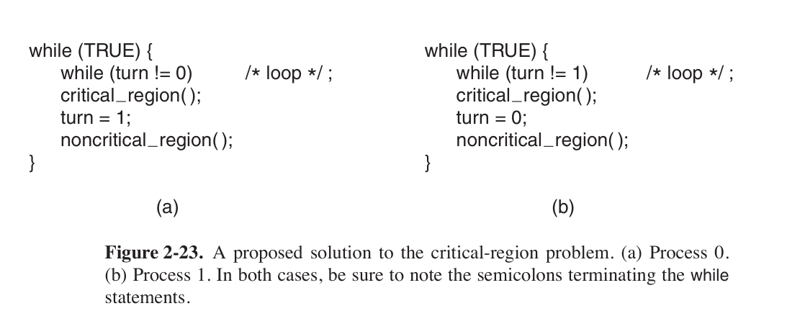

Viola a $3^a$ clausula, nenhum processo deve ser bloqueado sem estar na sua região crítica.

#### TSL (*Test and set Lock*) \

`TSL RX LOCK`

Lê lock para o registrador `RX` e coloca um valor não nulo em `LOCK`.
É uma instrução garantida de ser atômica.

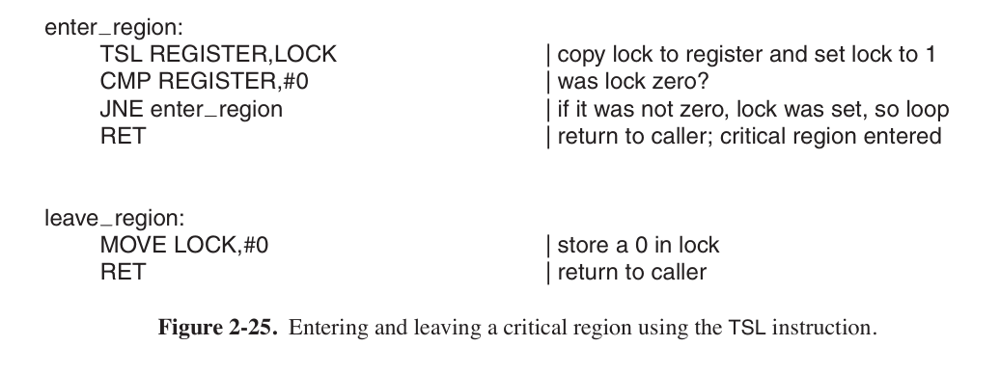

### *Sleep* & *wakeup*

Em todas as soluções que apresentamos, ocorre busy waiting. Vamos apresentar algumas soluções que 
se baseiam em comunicação interprocessos para saber qual processo deve agir.

#### Problema produtor-consumidor \

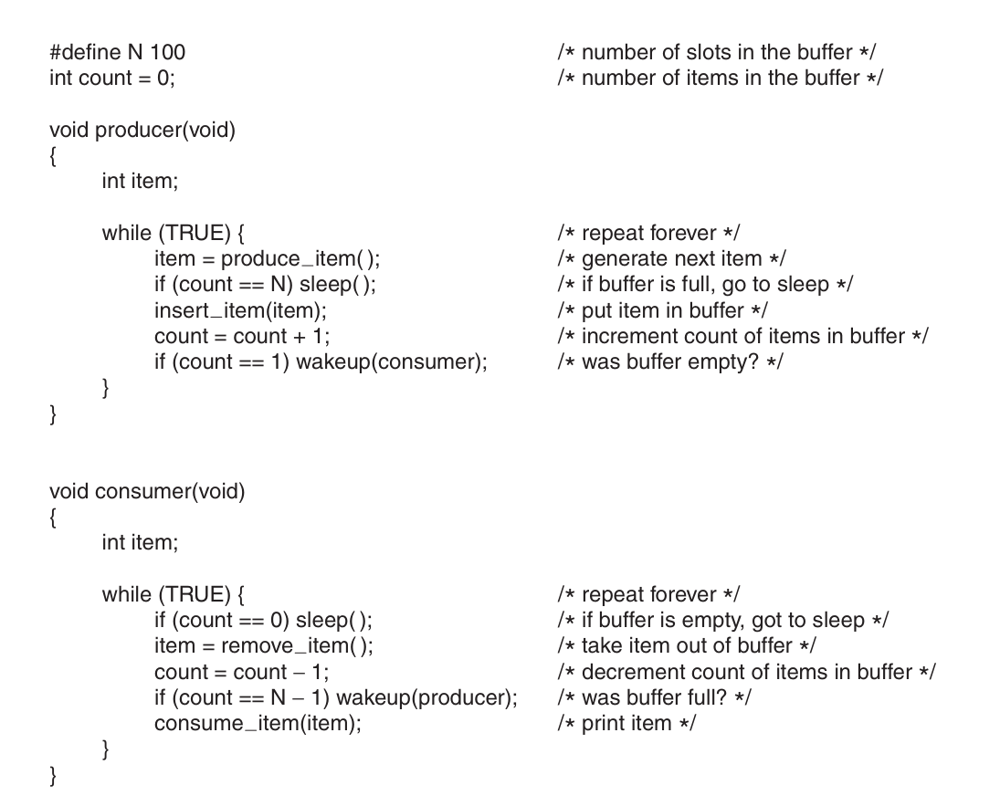 \

Caso: o buffer estava vazio, e o consumidor **lê** `count` para saber se era $0$,
nesse momento, o escalonador troca para a thread do produtor, que insere um item, 
aumentando `count` para $1$. Imaginando que `count` era $0$ e o consumidor deve estar
dormindo, o produtor tenta acordá-lo. 

O consumidor não estava dormindo, então o sinal é perdido. O consumidor é escalado, testa
o valor que ele tinha lido de $0$, e dorme. Em algum momento o produtor vai encher o buffer e dormir também,
sem acordar o consumidor. Ambos dormirão para sempre.

- Problema:
> O wakeup é perdido.

#### Semaforos

- Pseudo chamadas de sistema `up` e `down`.

- Semaforo guarda um valor positivo se existe um N up's pendentes e 0 se não houver nenhum.

- Operação atómica.

#### Mutexes

- Exclusão mútua

- Semaforo binário

## Escalonamento

### Comportamento de um processo

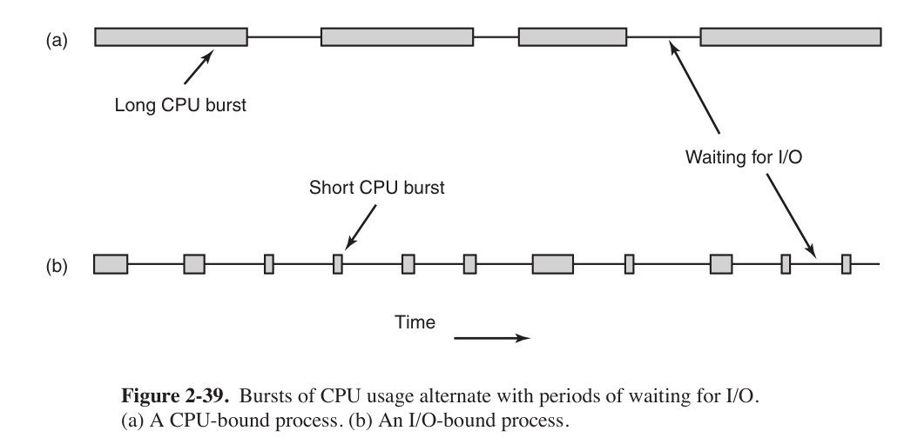

- Processo passa um tempo usando CPU, outro utilizando I/O 

- I/O é quando o processo entra em estado de bloqueado

- I/O bound

- CPU bound

### Quando escalonar?

1. Quando um processo é criado
2. Quando um processo termina
3. Quando um processo é bloqueado por I/O
4. Quando uma interrupção de I/O acontece.

### Categórias de algoritmos de escalonamento

1. Batch

> Maximizar jobs por hora

> Evitar gastar tempo no sistema operacional

2. Interativo

> Responder as requisições rapidamete

> Suprir as expectativas do usuário

3. Tempo real

> Cumprir com prazos

> Evitar perder dados

### Escalonamento em sistemas em batch

- First-Come, First-Served

- Shortest job first 

> Presume que sabe-se o tamanho de um job de antemão

- Shortest remaining time next

> Escolhe o que está mais próximo de terminar

### Escalonamento em sistemas interativos

- Round-Robin 

> Cada processo tem um *quantum* de tempo, ao acabar, outro é escalonado

- Priority scheduling

- Shortest process next

- Guaranteed scheduling

- Lottery scheduling

- Fair-Share scheduling

### Escalonamento em sistemas de tempo real

#### Condição
- Precisa cumprir a seguinte equação

$$
\sum_{i=1}^{m} \frac{C_i}{P_i} \leq 1
$$

- $m$ eventos periódicos e o evento $i$ com período $P_i$ requer $C_i$ segundos de CPU

- Só pode ser tempo real se entrar nessa inequação

#### Escalonadores

- Policy versus Mechanism

> Processos dizem quais são os mais importantes dos seus filhos

- Thread scheduling


## Problema dos filósofos comilões

### Explicação

- N filósofos em uma mesa circular, cada um com um garfo a esquerda e outra a direita. 
Ou eles pensam, ou comem usando dois garfos.

- Se todos pegam o garfo a sua direita, todos ficam bloqueados, sem poder nem comer, nem pensar.

### Solução.

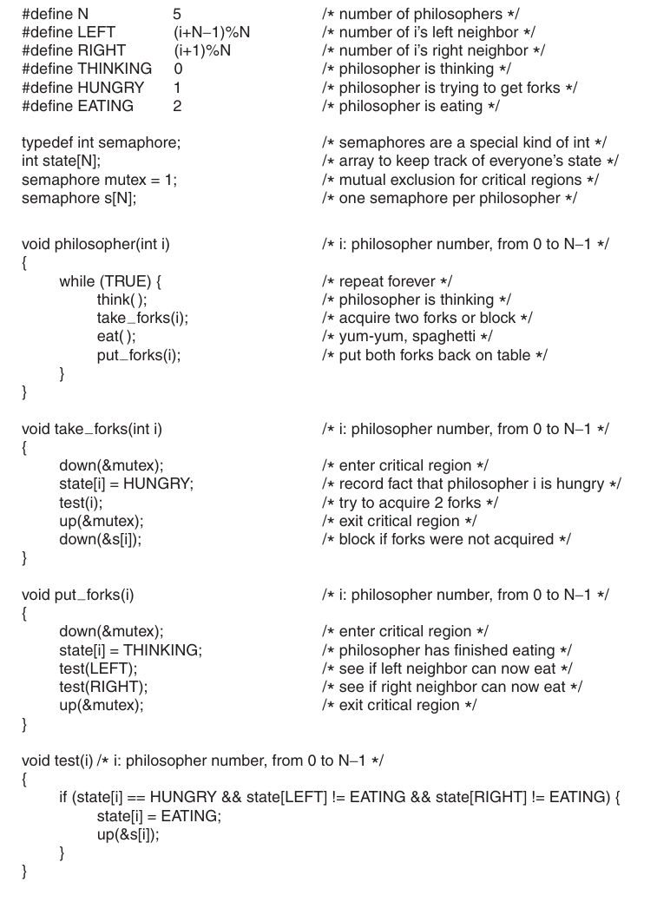 \

Solução cooperativa, filosofos dormem enquanto não podem comer, e os que estão comendo, ao terminar, 
acordam eles.

# Capitulo 3.

## Sem abstração de memória.

- Qualquer um escreve onde quer, na hora que quer.

- Somente um programa pode rodar simultaneamente.

## Espaços de endereçamento.

- Espaço de endereçamento é o conjunto de endereços que um proceso pode usar para 
sua memória

- Vários programas carregados.

### Base e Limite.

- Registradores para dizer o ínicio e fim da memória do programa

## Swapping.

- Por vezes, a memória para rodar todos os programas é maior que a memória do computador.

- Uma das técnicas: Processos em *idle* tem sua memória armazenada no disco.

## Lidando com memória livre.

### Bitmaps.

- 1 bit representa N bytes de memória, dependendo da escolha

- 0 para livre e 1 para ocupado

- Quanto menor o espaço por bit, maior a bitmap

### Listas ligadas.

- Lista de segmentos alocados e não alocados

- Ordenada por endereços

- Mais interessante ter uma lista duplamente ligada para mesclar a memória livre de um processo
terminado

## Memória Virtual.

- Programas muito grandes para caber inteiramente na memória

- Cada programa tem seu espaço de endereçamento que pode ser quebrado em várias páginas

- Paginas são faixas de endereços contíguos 

- Páginas são mapeadas para a memória física, mas nem todas estão nela.

- MMU(Memory management unit) faz conversão

- Ao consultar uma página que não esta na memória principal, o S.O
é alertado, procura a página no disco, e executa a instrução que deu 
page-fault

### Paginação.

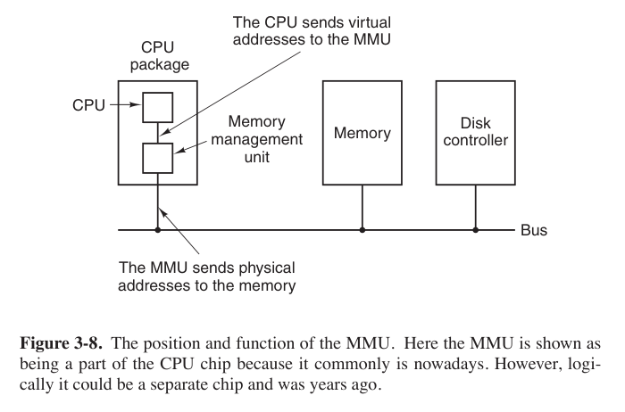

- Endereços são primeiramente direcionados a MMU, que converte para endereços físicos.

- O correspondente de uma página na memória física são chamadas de *page frames*

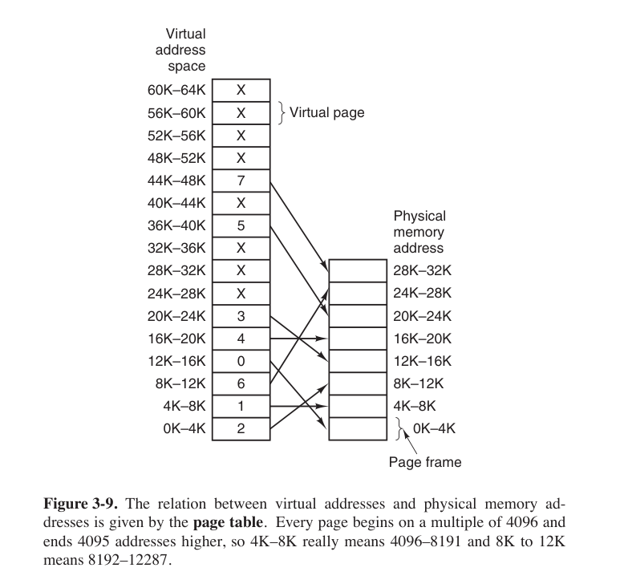

- MMU mapeia as páginas para page frames baseada em uma tabela fornecida pelo sistema operacional.

- Se a página não estiver presente na memória física, a CPU causa uma interrupção de hardware
para o sistema operacional. Essa interrupção é chamada de page fault.

### Tabelas de páginas.

- Endereço é separado em page number (high order bits) e offset (low order bits)

- Guarda bit de presença (1 -> presente, 0 -> ausente)

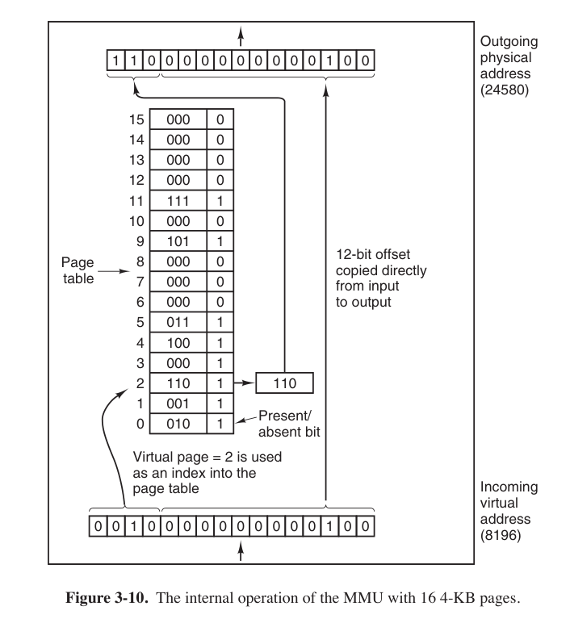

### Agilizando a paginação.

- Dois problemas são enfrentados em sistemas de paginação.

1. O mapemanto deve ser *rápido*
2. Se o endereço virtual é grande, a tabela de páginas é grande

### Tabelas de página para muita memória.

#### Tabelas multi nível.

- Tabelas são indexadas de maneira multinível

Exemplo:

> 32bits, 20bits para páginas e 12bits para offset,
dividimos os 20bits em 2 níveis de páginas,
uma com $2^{10}$ páginas e, para cada página dessa,
$2^{10}$ páginas com $2^{12}$ bits de tamanho de página,
4KB no caso.

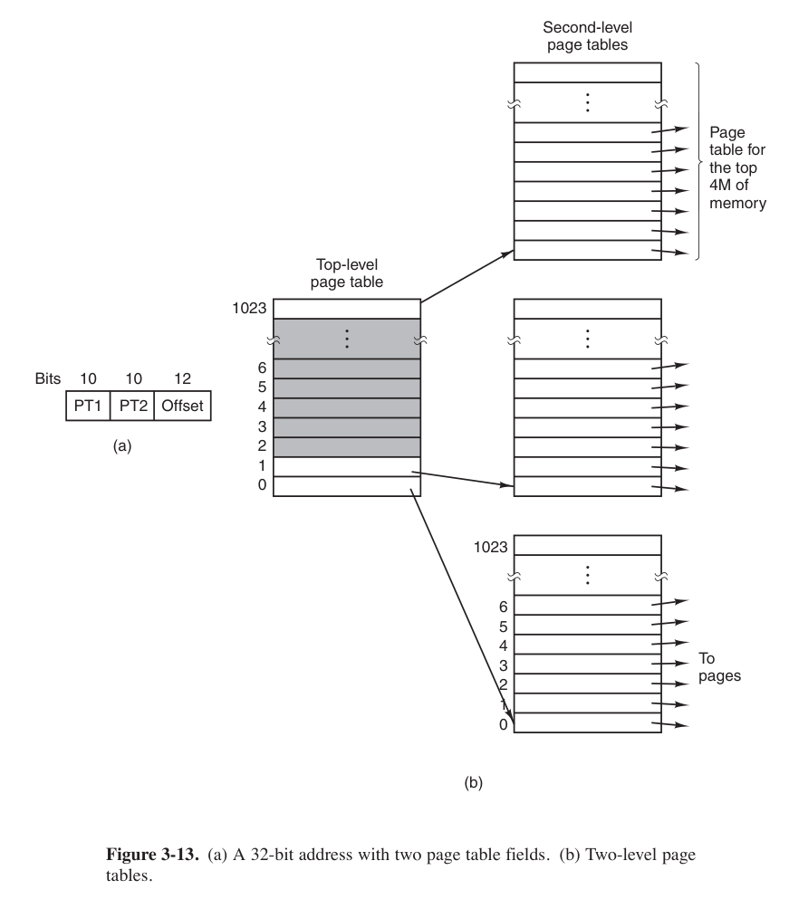

#### Tabelas invertidas.

- Precisa de pid, Page number e Offset

- Cada processo tem sua page table

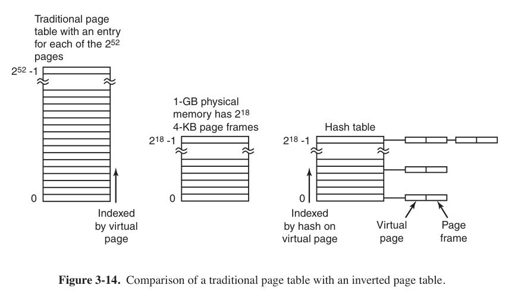

### Algorítmos de substituição de página.

#### O ótimo.

- Precisa saber por quantas instruções uma página não vai ser usada

- Tira a página que vai demorar mais pra ser usada

- Impossível de implementar

#### Not recently used (NRU).

- Bit M(odificado) e R(eferenciado)

- Começa com 0 para ambos

- Clock interrupt seta R para 0

#### First-In First-Out (FIFO).

- Remove a página que foi adicionada a mais tempo 

#### Second-Chance.

- Modificação do FIFO

- Usa bit R para saber se foi usada recentemente

\pagebreak

```
    Repete
        Se bit R da página mais antiga for 0
            Remove a página
            Termina
        Senão
            Seta o bit R para 0 
            Coloca página no ínicio da lista # como se fosse uma página nova
```

#### Clock.

- Mesmo que Second-Change, mas usa uma lista circular

- Ao invés de remover a página e adicionar no final,
muda o ponteiro para o próximo

#### Least Recently Used (LRU).

- Caro de implementar

- Lista com todas as páginas que precisa ser reordenada a cada referencia

#### Not Frequently Used (NFU).

- Contador com todas as vezses que foi referenciado

- Não esquece nunca

- Modificação, dá shift right e adiciona bit a esquerda

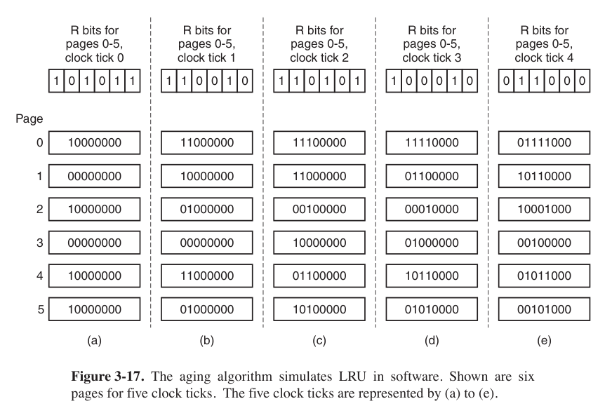

#### Working Set Algorithm.

- Conjunto de páginas que um processo está usando.

- Um exemplo de algoritmo

```
    Para p em páginas faça
        Se p.R = 1 
            p.time = time() 
        Se p.R = 0 e time() - p.time > age 
            remove p


```

#### WSClock.

- Usa uma lista circular de page frames

- Cada *entry* contém a idade(tempo desde a ultima vez referenciado)

- Se o bit R for 0, a idade for maior que tao e estiver limpa,
simplesmente substitui com a nova página.

- Se o bit R for 0, a idade for maior que tao e estiver suja, 
agenda a limpeza e continua o algoritmo.

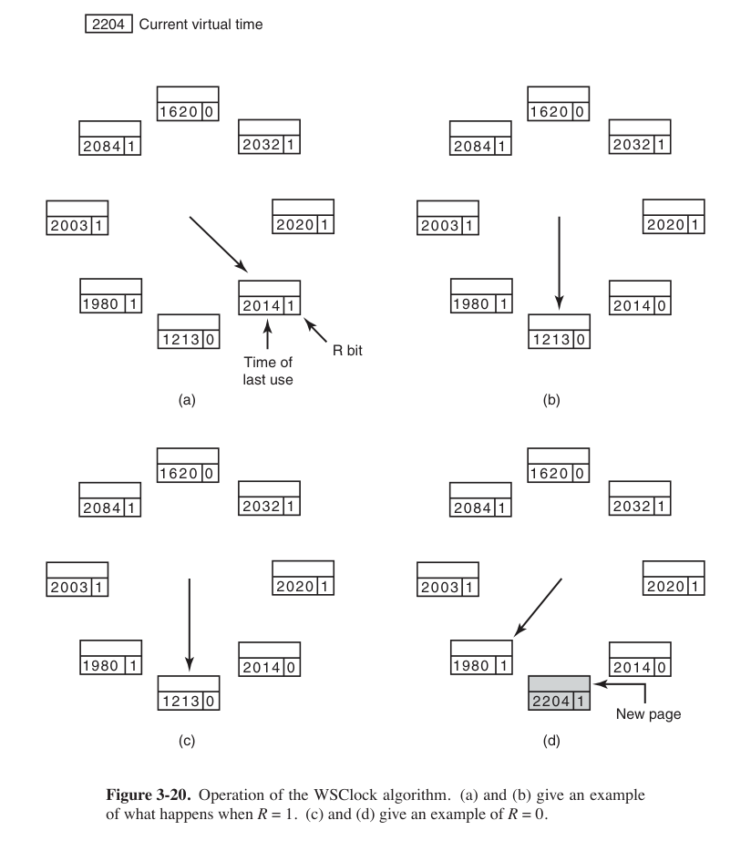

### Problemas de Design em paginação.

#### Políticas globais vs locais.

- Algoritmos podem atuar vendo as páginas totais ou por processo.

- Podemos usar PFF(Page fault frequency) algorithm para definir quantas páginas cada 
processo deve ter.

- Processos podem receber mais páginas para diminuir seu page fault.

#### Controle de carga.

- Enviar alguns o espaço de endereçamento de alguns processos para o disco
e dar as páginas dele para outros processos

#### Tamanho da página.

- Em média, metade da ultima página alocada para algum dado
contíguo não vai estar sendo usada. O nome disso é *fragmentação interna*

- Com $n$ segmentos em memória e uma página de tamanho $p$ bytes, $np/2$ será 
desperdiçada em fragmentação interna.

- Outro argumento para um tamanho de página pequeno, é que programas tem 'fases',
que pode ser que uma parte do text não esteja sendo usada e, se a página for grande,
estará comportando todo ele.

- Mas páginas pequenas aumentam muito o tamanho das tabelas de páginas.

 Suponha que o tamanho médio de um processo é $s$ bytes. Suponha que cada page entry
requeira $e$ bytes. O número de páginas por processo é $s/p$, ocupando $se/p$ page entries.
O desperdício na última página devido a fragmentação interna é $p/2$.
Então o overhead pode ser calculado dessa forma

$$
    overhead = \frac{se}{p} + \frac{p}{2}
$$

 O primeiro termo é grande quando o tamanho da página é pequeno. O segundo é grande quando o tamanho
da página é grande. Tomamos a primeira derivada em respeito a $p$ e igualamos a zero.

$$
    overhead = -\frac{se}{p^2} + \frac{1}{2}
$$

 O tamanho ótimo de página é:

$$
    p = \sqrt{2se}
$$

#### Separar de espaços de endereçamento.

- *I spaces* e *D spaces* para separar text e data

#### Páginas compartilhadas.

- *Text* pode ser compartilhado, pela sua natureza read-only.

- *Data* é mais díficil de compartilhar, devido a sua natureza de escrita.

- `fork` compartilha páginas de memória, só modificando em escrita (COW)

#### Bibliotecas compartilhadas.

- São carregadas só uma vez para a memória.

#### Política de limpeza.

- Paginação funciona melhor se tem muitas páginas livres.

- ***paging daemon*** acorda periodicamente e inspeciona a memória,
escreve páginas no disco, preseleciona páginas.

### Problemas de implementação.

#### Page fault handling.

1. The hardware traps to the kernel, saving the program counter on the
stack. On most machines, some information about the state of the
current instruction is saved in special CPU registers.
2. An assembly-code routine is started to save the general registers and
other volatile information, to keep the operating system from destroy-
ing it. This routine calls the operating system as a procedure.
3. The operating system discovers that a page fault has occurred, and
tries to discover which virtual page is needed. Often one of the hard-
ware registers contains this information. If not, the operating system
must retrieve the program counter, fetch the instruction, and parse it
in software to figure out what it was doing when the fault hit.
4. Once the virtual address that caused the fault is known, the system
checks to see if this address is valid and the protection is consistent
with the access. If not, the process is sent a signal or killed. If the ad-
dress is valid and no protection fault has occurred, the system checks
to see if a page frame is free. If no frames are free, the page re-
placement algorithm is run to select a victim.
5. If the page frame selected is dirty, the page is scheduled for transfer to
the disk, and a context switch takes place, suspending the faulting
process and letting another one run until the disk transfer has com-
pleted. In any event, the frame is marked as busy to prevent it from
being used for another purpose.
6. As soon as the page frame is clean (either immediately or after it is
written to disk), the operating system looks up the disk address where
the needed page is, and schedules a disk operation to bring it in.
While the page is being loaded, the faulting process is still suspended
and another user process is run, if one is available.
7. When the disk interrupt indicates that the page has arrived, the page
tables are updated to reflect its position, and the frame is marked as
being in the normal state.
8. The faulting instruction is backed up to the state it had when it began
and the program counter is reset to point to that instruction.
9. The faulting process is scheduled, and the operating system returns to
the (assembly-language) routine that called it.
10. This routine reloads the registers and other state information and re-
turns to user space to continue execution, as if no fault had occurred.

#### Backup de instrução.

- Na eminência de um page fault, o kernel é chamado e a instrução interrompida.

- É preciso executar essa instrução depois.

- Execucação da instrução pode parar em PC=10002 , que é um endereço de memória
e não teria como saber que instrução estava em PC=10000.

#### Travando páginas na memória.

#### Guardando páginas no disco.

- Partição separada.

1. **Partição de Swap com Áreas Pré-alocadas**: As páginas são armazenadas em
   uma partição de swap dedicada no disco, alocada previamente. Cada processo
tem uma área reservada onde suas páginas são salvas, e o cálculo do endereço é
simples com base na área de swap do processo.

2. **Alocação Dinâmica de Páginas**: As páginas são trocadas para o disco de
   forma dinâmica, sem espaço alocado previamente. Um novo local no disco é
escolhido cada vez que uma página é trocada, e um mapa de disco rastreia a
localização de cada página, evitando reservar espaço de swap desnecessário.

#### Separação de política de mecanismo.
